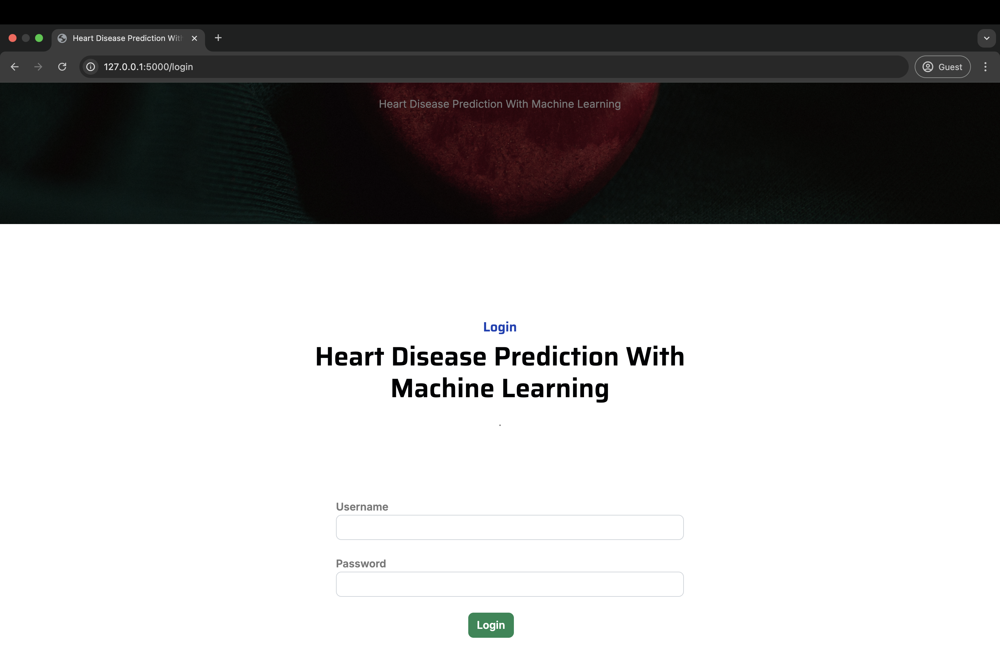
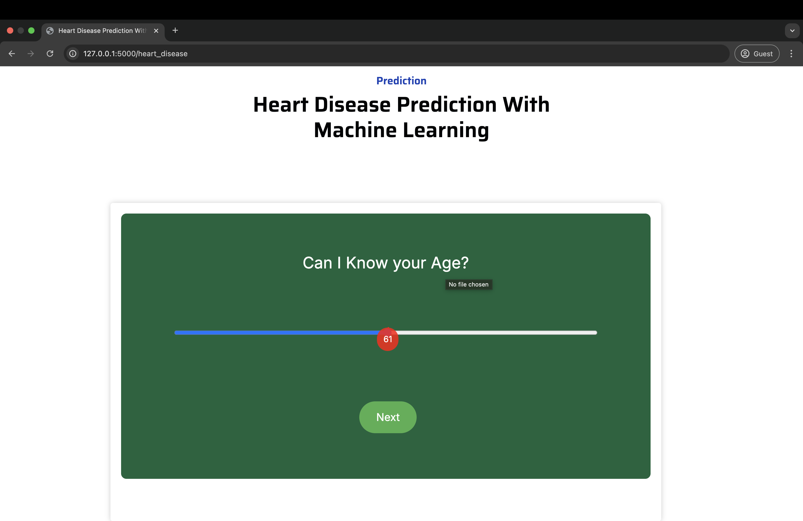
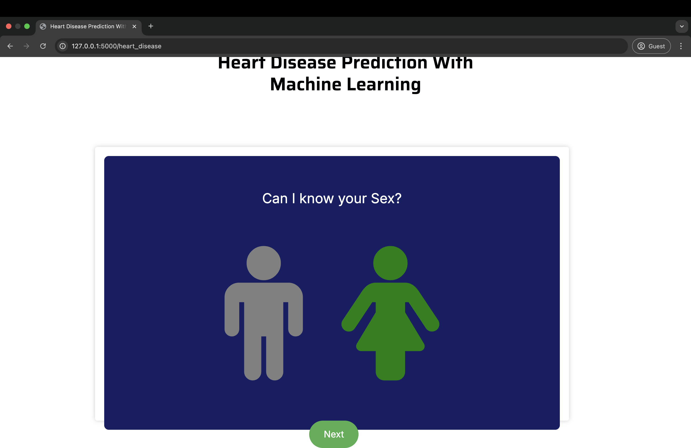
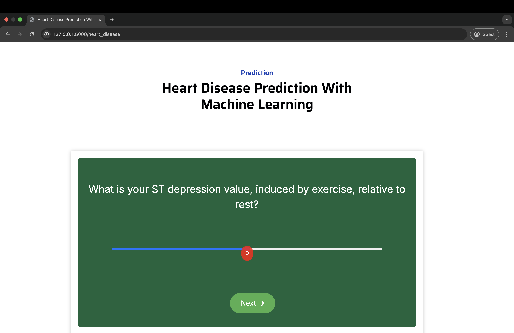
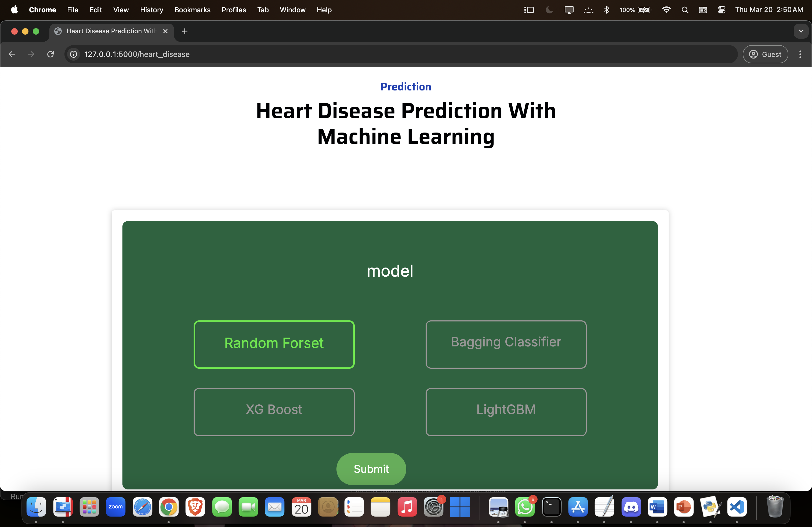
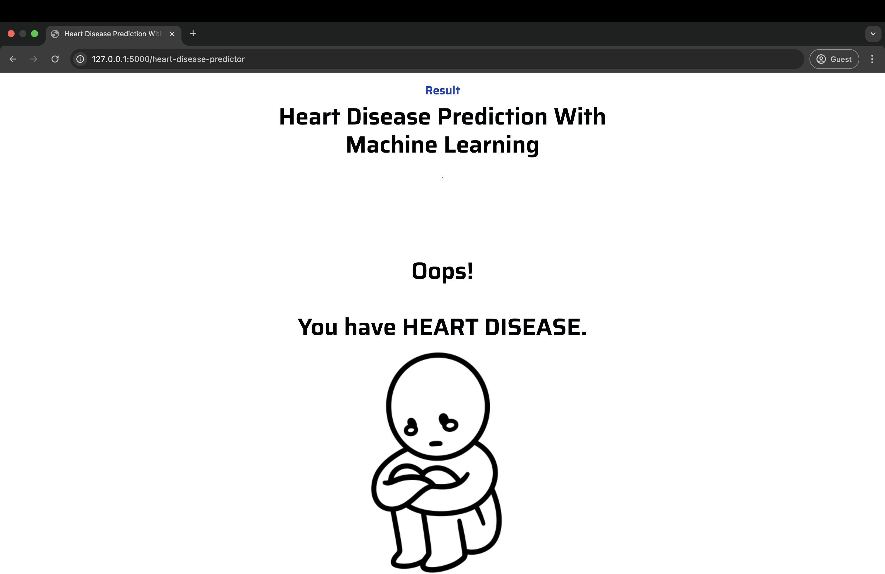

# Heart Disease Prediction With Machine Learning 🫀

Welcome to the **Heart Disease Prediction With Machine Learning** project! This repository demonstrates a comprehensive approach to predicting heart disease using machine learning. By leveraging four powerful algorithms—Random Forest, Bagging Classifier, XG Boost, and LightGBM—the project achieves outstanding accuracy and provides insights into early detection.


## Project Overview

This project is inspired by the IEEE paper titled:  
**Effective Feature Engineering Technique for Heart Disease Prediction With Machine Learning**

### IEEE Base Paper Abstract
Heart failure is a chronic condition affecting millions worldwide. The referenced study introduces a novel Principal Component Heart Failure (PCHF) feature engineering technique to select the most significant features from patient data. Through extensive experiments, the decision tree method achieved 100% accuracy, showcasing the power of machine learning in early detection and effective treatment strategies.

### Project Abstract
Our implementation uses Python-based machine learning to predict heart disease with remarkable accuracy. By employing four distinct algorithms (Random Forest Classifier, Bagging Classifier, XG Boost, and LightGBM), the system achieved 100% accuracy on both training and test datasets, working with a dataset of 1025 records across 14 features. This project underscores the potential of predictive analytics in healthcare, enabling more reliable diagnosis and timely intervention.


## Features

- **Multiple Algorithms:** Implements Random Forest, Bagging Classifier, XG Boost, and LightGBM.  
- **High Accuracy:** Achieves 100% accuracy on both training and test datasets.  
- **Feature Engineering:** Demonstrates an innovative approach to selecting influential features.  
- **Comprehensive Dataset:** Utilizes 1025 records with 14 distinct attributes.  
- **Robust Validation:** Models validated through cross-validation for consistent results.


## System Requirements

### Hardware Requirements
- **Processor:** Pentium i3 (or higher)  
- **RAM:** 8 GB  
- **Storage:** 500 GB Hard Disk (or SSD)  
- **Monitor:** 15” LED (or larger)  
- **Input Devices:** Keyboard and Mouse  

### Software Requirements
- **Operating System:** Windows 10 / 11  
- **Programming Language:** Python 3.10.9  
- **Web Framework:** Flask  
- **Frontend:** HTML, CSS, JavaScript  


## Installation

1. **Clone the Repository:**
   ```bash
   git clone https://github.com/yourusername/heart-disease-prediction-ml.git
   cd heart-disease-prediction-ml
   ```

2. **Install Dependencies:**
   Make sure you have Python 3.10.9 installed. Then run:
   ```bash
   pip install -r requirements.txt
   ```

3. **Run the Application:**
   Start the Flask application with:
   ```bash
   python app.py
   ```
   Open your browser and navigate to `http://127.0.0.1:5000/` to interact with the project.


## Usage

- **Data Exploration:** Examine the dataset (14 features) to understand the inputs for heart disease prediction.  
- **Model Training:** Use the provided scripts or notebook to train and evaluate each of the four algorithms.  
- **Feature Engineering:** Explore how feature selection influences model performance.  
- **Prediction & Results:** Run predictions on new or test data to see how the models classify heart disease risk.


## Screenshots and Media

Below is a table showcasing all the screenshots from the project.  
Make sure you have uploaded `1.png` through `7.png` in your repository (in the same directory as the README, or adjust paths as needed).

| Screenshot                          | Description                                                                 |
|-------------------------------------|-----------------------------------------------------------------------------|
|                          | **Home Page**<br>The main interface showcasing the project’s title and theme. |
|                          | **Login Page**<br>Allows users to enter their credentials to access the system. |
|                          | **Age Input**<br>Prompt for user’s age as part of the health parameters.     |
|                          | **Sex Input**<br>Prompt for user’s sex, another key input for heart disease risk. |
|                          | **ST Depression Input**<br>User slides to select ST depression value induced by exercise. |
|                          | **Model Selection**<br>Shows the four ML algorithms: Random Forest, Bagging Classifier, XG Boost, and LightGBM. |
|                          | **Prediction Result**<br>Displays the final outcome (e.g., “You have HEART DISEASE”). |


## Reference

**Paper Reference:**  
Azam Mehmood Qadri, Ali Raza, Kashif Munir, and Mubarak S. Almutairi, “Effective Feature Engineering Technique for Heart Disease Prediction With Machine Learning,” *IEEE Access*, Volume 11, 2023.


## Author

**Created by [Arshita](https://github.com/arshita08)**
